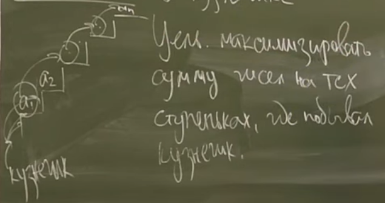
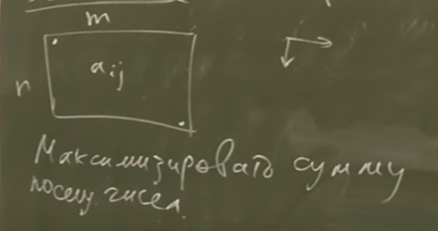
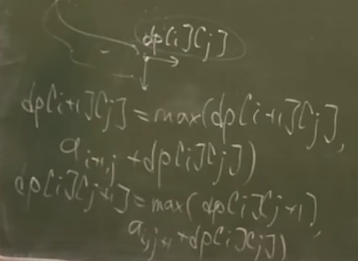
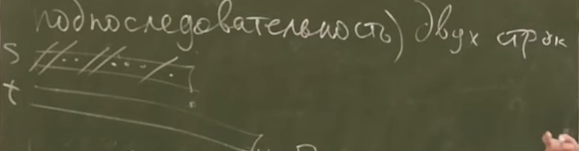
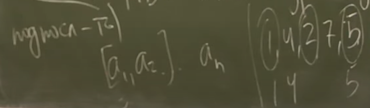

# DP introduction
***
### Что нужно для работы dp
> 1. Что хранится в dp?
> 2. База dp.
> 3. Формула пересчета.
> 4. Порядок пересчета.
> 5. Где лежит ответ?
### Задача о кузнечике

> 5 шагов для построения dp:
```c++
dp[i] // - max  сумма если лестница ограничена первыми i-ступеньками
```
```c++
dp[0] = 0;
dp[1] = a[1]
```
```c++
i >= 2;
dp[i] = a[i] + max(dp[i - 1] + dp[i - 2]);
```
```c++
i = 1, 2, ..., n // - в порядке возрастания
```
```c++
dp[n] 
```
> можно хранить только dp[i], dp[i - 1], dp[i - 2], используя O(1) памяти и O(n) времени

### Задача о черепашке

> 5 шагов для построения dp:
```c++
dp[i][j]; //- ответ для прямоугольника (0,0,i,j)
```
```c++
dp[1][1] = a11;
```
```c++
d[i][j] = aij + max(dp[i - 1][j], dp[i][j - 1]);
```
```c++
for(int i = 1; i <= n; ++i)
    for(int j = 1; j <= n; ++j)
        ...;
```
```c++
dp[n][m];
```
> Можно хранить только одну полную строку dp, т.е. использовать O(min(n, m)) памяти и O(n *  m) времени.
### Динамика "вперед"
> Вычисляя значение "проталкиваем" его вперед



> До этого была динамика где мы смотрели на уже посчитанные значения (динамика назад)

### Задача о наибольшей общей подпоследовательности (НОП)

```c++
dp[i][j] // длина НОП для s[1...i] и t[1...j]
```
```c++
if(s[0] == t[0])
    dp[0][0] = 1;
```
```c++
if(s[i] == t[j])
    dp[i][j] = dp[i - 1][j - 1] + 1;
dp[i][j] = max(dp[i][j], dp[i - 1][j], dp[i][j - 1]);
```
```c++
for(int i = 1; i <= n; ++i)
    for(int j = 1; j <= n; ++j)
        ...;
```
```c++
dp[n][m];
```
> Можно использовать O(m) памяти и O(nm) времени
### Задача о наибольшей возрастающей подпоследовательности (НВП)

```c++
dp[i];//- длина НВП в массиве [a1,...,ai], которая заканчивается в ai
```
```c++
dp[0] = 0; // 1? 
```
```c++
dp[1] = max(1 + dp[j]); // (j = {1, 2, 3, ..., i - 1} | a[j] < a[i])
```
```c++
for (int i = 1; i <= n; ++i)
    for (int j = 1; j < i; ++j)
        ...;
```
```c++
max(dp[i]);
```
#### Другое решение за O(n^2)
> Пусть b - отсортированное без повторов a, тогда НВП(а) = НОП(а, b)
#### Первое решение за O(n * log n) | Дерево Фенвика (Отрезков)
> Оживляем числа в порядке возрастания  
> Пусть a[k1] < a[k2] < ... < a[kn]  
> Заводим дерево Фенвика (Отрезков)
> [0, n] заполняем -inf
> 
```c++
for (int i = 1; i <= n; ++i) {
    x = get(1, ki - 1); // log n
    update(ki, max(1, 1 + x)); // log n
}
```
#### Второе решение за O(n * log n) | Бинпоиском
```c++
dp[i][k]; // min последний элемент в ВП из [a1,...,ai] или +inf если нет такой ВП
```
> Тогда dp[i] - возрастает
```c++
база - ну придумай сам(а)
```
```c++
//dp[i][*] -> dp[i + 1][*]
dp[i + 1][k] = a[i + 1] or dp[i][k];  
//каждая строчка отличается от предыдущей не более чем на одно значение (так как оно равно a[i + 1] и строчка возрастает)
//на a[i + 1] заменяется первое число большее a[i + 1] 
// ищем его за n(log n)
```
```c++
for (int i = 0; i < n; ++i)
    dp[i][*] = ...;
```
```c++
max k : dp[n][k] != + inf;
```

> память O(n), время O(n * log n)