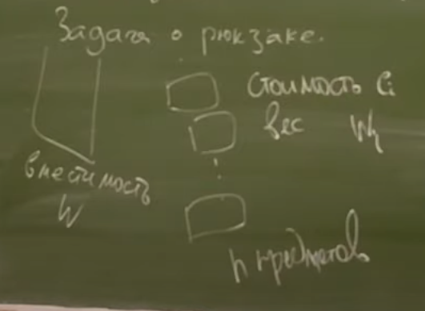
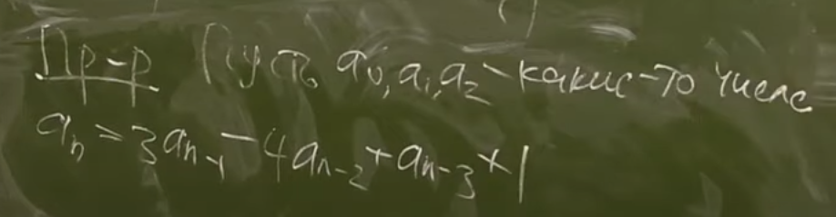

# DP продолжение.
***
### Задача о рюкзаке

```c++
dp[i][x]; // макс. сумм. стоимость предметов если есть только первые i предметов,
// а суммарный вес ровно x
// -inf если нельзя набрать такой вес
```
```c++
dp[0][0] = 0;
dp[0][>0] = -inf;
```
```c++
dp[i + 1][x] = max(dp[i][x], dp[i][x - w[i + 1]] + c[i + 1]);
```
```c++
for(int i = 0; i < n; ++i)
    for(int x = 0; x < W; ++x)
        dp[i][x] = ...;
```
```c++
x = {0, 1, 2,...,W};
max(dp[n][x]);
```
> O(n * W) времени и O(W) памяти  
### Второе решение
```c++
dp[i][y]; // - минимальная сумма предметов, если доступны первые i,
// и нужно взять предметов суммарной стоимости y
```
```c++
--||--
```
```c++
dp[i + 1][y] = min(dp[i][y], dp[i][y - c[i + 1]] + w[i + 1]);
```
```c++
--||--
```
> O(n * C) времени и O(C) памяти
### Восстановление ответа
Хотим знать, какие предметы нужно взять, чтобы набрать макс вес
> Будем дополнительно хранить: ``p[i][x] = 0``, если значение ``dp[i][x]`` достигается без взятия i-го предмета, ``p[i][x] = 1`` иначе.  
> Ответ dp[n][x] = 0 => dp[n - 1][x] | = 1 => dp[n - 1][x - w[n]]  
> Приходится использовать O(n * W) памяти  
> Но используя корневую декомпозицию можно уменьшить асимптотику

### Почему не работает жадный алгоритм?
Наивный: брать предмет макс. стоимости, пока он вмещается в рюкзак
> Контр пример -  c1 = 2, w = 100, ... ci = 1, wi = 1

Менее наивный: брать предмет макс плотности
> Контр пример - надеюсь, что придумаю на экзе

Пока неизвестно ни одного алгоритма, который бы работал за Poly(|input|)
> n, W + n пар (wi, ci) = log n + log W + n(log W + log C_max) - длина входа =>  
> n*W будет экспонентой от длины входа  
> NP трудная задача
### Задача о числах Фибоначчи

> Решение через возведение матрицы в степень:


 > Быстрое возведение матрицы в степень: 


### Подсчет n-го значения реккуренты a[n] = λ\*a[n−1] + µ*a[n−2] + 1
Пусть a1, a2, a3 - какие-то числа,  
тогда найдем a[n]


> Из этой задачи понятно как решать более простую реккуренту с двумя коэффициентами
### Кол-во путей в графе
Задача: найти число путей из u в v длины ровно k (по модулю m).  
Решение: пусть M - матрица смежности графа, тогда (M^k)[i][j] - число путей из i в j длины ровно k.  
Докажем это утверждение по индукции по k:


> Асимптотика O(n^3 * log k)

### Нахождение A + A^2 + . . . + A^k за O(n3 log k) для матрицы A размера n × n.
#### Это решает задачу поиска путей из i в j, длины <= k
> Найти сумму геом прогрессии по формуле не получится, так как м.б. нельзя делить матрицы

Пусть f(M, k) = (M^k, M^1+M^2+...+M^k).  
Тогда пусть f1(M, k) = f(M, k)[1], f2(M, k) = f(M, k)[2].  
Тогда f1(M, k) = f1(M, k - 1) * M, если k - неч  
| f1(M, k/2) ^ 2, если k - чет   
Тогда f2(M, k) = f2(M, k - 1) + f1(M, k), если k - неч  
| f2(M, k/2) * (1 + f1(M, k / 2)), если k - чет 

> Асимптотика O(n^3 * log k)

### Есть ли хотя бы один путь из i в j длины ровно k? 
Переопределим умножение матриц так, чтобы выполнялось условие: 


Достаточно доказать ассоциативность такого умножения, чтобы можно было использовать быстрое возведение в степень. 
