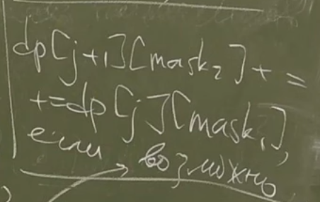

# DP - по маскам (по подмножествам)
***
Есть множество размера n (<= 30),  
тогда любое подмножество A можно закодировать двоичным представлением 30-битного числа.  
Подойдет ``int`` 
### Операции над масками

```c++
//1. Извлечение бита, проверка наличия эл-та в мн-ве
bool bit(int mask, int pos) 
{
    return (mask>>pos)&1; 
}
```
```c++
//2. Объединение мн-в
bool bit(int mask1, int mask2) 
{
    return mask1 | mask2; 
}
```
```c++
//3. Пересечение мн-в
bool bit(int mask1, int mask2) 
{
    return mask1 & mask2; 
}
```
```c++
//4. Разность мн-в
bool bit(int mask1, int mask2) 
{
    return (mask1|mask2)^mask2; 
}
```
### Задача 1. Самый дешевый гамильтонов путь.
  
NP-трудная задача  
Состояние характеризуется номером последней вершины и мн-в посещенных.
```c++
dp[v][mask]; // min вес пути, который заканчивается в v
// и посещает вершины из mask по 1 разу
```
```c++
dp[*][*] = +inf;
dp[v][2^v] = 0;
```
```c++
//forward
for (int u = 0; u < n; ++u)
    if (!bit(mask, u)) {
        newmask = mask | (1 << u);
        dp[u][newmask] = min(dp[u][newmask], dp[v][mask] + cost[v][u]);
    }
```
```c++
// Надо перебирать маски в порядке включения,
// но для этого достаточно перебирать их в порядке возрастания
for (int mask = 0; mask < 2^n; ++mask)
    ...;
```
```c++
min(dp[v][2^n - 1]); // v = {0, 1,..., n-1}
```
> Асимптотика О(2^n, n^2) времени и О(2^n, n^2) памяти
### Задача 2. Дан граф, найти в нем максимальную клику
> Клика - множество попарно соединенных вершин.  

Тоже NP-трудная задача. 
#### Решение 1, за О(2^n * n^2) - полный перебор  

#### Решение 2, за О(2^n * n) dp[mask] = true(false)
```c++
dp[mask] = true; // <=> для вершины v верно, что mask\v - клика и
// v соединена со всеми вершинами из mask\v
```
> За О(2^n * n)
#### Решение 2.5, за О(2^n * n), через u и v

```c++
dp[mask] = 
        dp[mask\v] &&
        dp[mask\u] &&
        edge(u, v);
```
#### Решение 3, за O(2^n), используя oldest
Пусть v - старший бит в mask
```c++
int oldest = -1;
for (mask = 0; mask < 2^n; ++mask) {
    if (!(mask & (mask - 1))
        ++oldest;
    ...; // используем oldest вместо v
}
```
Для каждой вершины посчитаем маску её соседей ``neighbor[u]``  
Используя этот массив, можем за О(1) делать переход
> Асимптотика O(2^n)
#### Решение 4, за O(2^(n/2) * n), через разделение на два множества
U и V - клика, если:

```c++
dp1[U]; // - маска вершин из правой доли,
// каждая из которых соединена со всеми вершинами из U 
dp2[W]; // - размер максимальной подклики в маске W (правая доля)
```
```c++
dp1[0] = 2^M - 1;
```
```c++
dp1[mask] = dp1[mask\oldest] && neighbor[oldest]; // neighbor - маска соседей oldest в правой доле
```
#### Оптимизация до O(2^(n/2))
```c++
dp2[mask] = max(dp2[mask\oldest], 1 + dp2[mask & neighbor[oldest]]);
// т.е. мы перебираем oldest в правой доле
// за O(2^n/2)
```
#### Про b(mask) = max a(s)

```c++
if(!bit(mask, M-k)) 
    b[k - 1][mask] = b[k][mask];
else
    b[k - 1][mask] = max(b[k][mask], b[k][mask\(m-k)])
```
```c++
dp2[mask] = b[0][mask]; // O(2^n/2 * n)
```

### ДП по профилю, доминошки (профилятор?!)




