# Хеш-таблицы
***
> Деревья поиска:
> - insert
> - erase
> - find  
> За O(log n)

> Хеш-таблицы:
>- insert
>- erase
>- find  
> За O(1)*  
> \* - амортизированное и усредненное
 
### Хеш-таблицы цепочками
U - универсум, все ключи - его эл-ты.  
``h : U -> {0, 1, ..., m - 1}``  
Массив длины m - хеш-таблица.  
i-й эл-т массива - односвязный список ключей с хешем равным ``i``
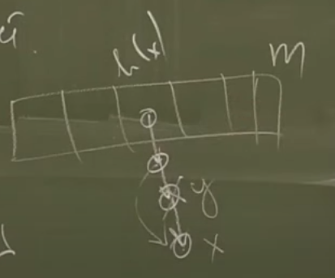

>- ``find x`` - посчитать хеш ``x``, пройтись по списку
>- ``insert x`` - посчитать хеш ``x``, добавить в начало/конец списка
>- ``erase x`` - посчитать хеш значение, пройтись по списку, найти ``x`` и удалить его

> Общая идея: ``h`` - случайна.
> Т.е. есть H - семейство ф-ий, и мы случайно равновероятно выбираем ``h``

### Универсальные семейства хещ ф-ий
> Опр. Сем-во хеш ф-ий H наз-ся универсальным, если:

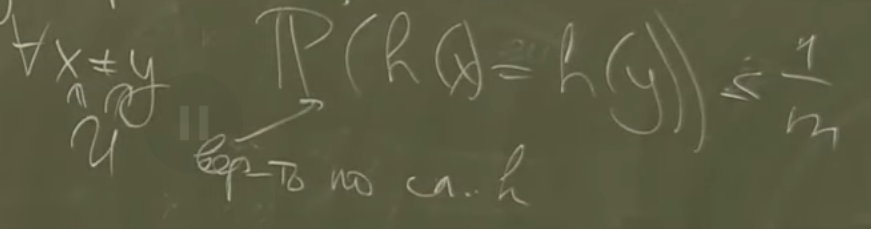
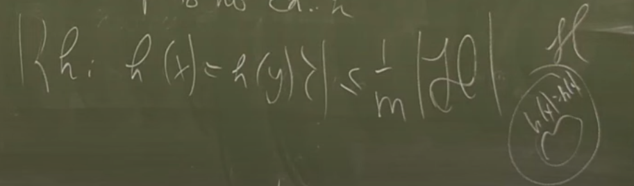

> Теор. Если H - универс. СХФ, то мат. ож. времени обработки всех запросов есть O(1+a), где a = n / m
>  (n - кол-во вставл. ключей)  
> load factor a

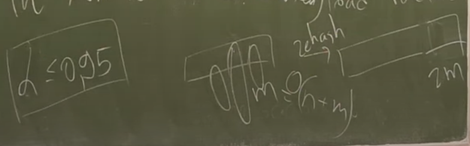

> Вып. операции как обычно, но если a превышает порог, то делаем rehash:  
> * расширяем таблицу в два раза
> * пересчитываем хеш-функцию
> * перекладываем эл-ты  
> Аморт О(1)*

##### Пример универсального семейства
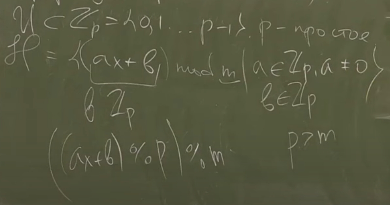
### Совершенное хеширование
> Даны ``a1,...,an`` далее - запросы только с этими ключами.  
> Построим за О(n) такую структуру, что:
>- insert - O(1)
>- erase - O(1)
>- find   - O(1)

Пусть ``hout`` - фикс, а ``ci = |{j: hout(aj) = i}|``  
1) hout нужно выбрать так, чтобы 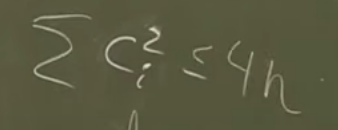  
Генерируем hout, пока это условие не выполнится (вероятность 1/2)  
   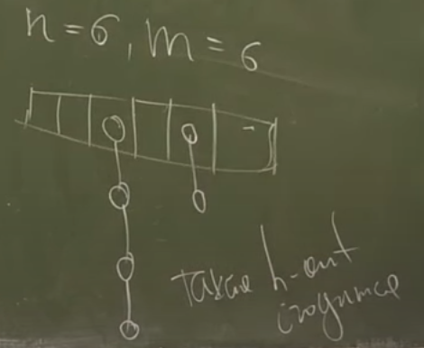
2) Для каждого i построим свою хеш-таблицу размера ``ci^2``
3) Далее подбираю (для каждого i) hi так, чтобы она не давала коллизий.
> Теорема(б/д). Если x1,...,xk - разл. ключи, m = k^2, H - универс сем-во, то 
> 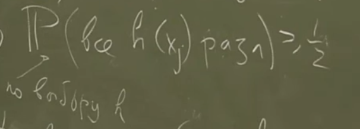
### Хеш-таблица с открытой адресацией

Массив чисел размера ``m``.  
``h(x)``

>- insert - считаем j = h(x), идем направо в поисках первой свободной клетки (или клетки с tombstone)
>- find   - идем по j, j+1, ... до первой свободной клетки или x
>- erase - find + кладем tombstone
>- делаем rehash

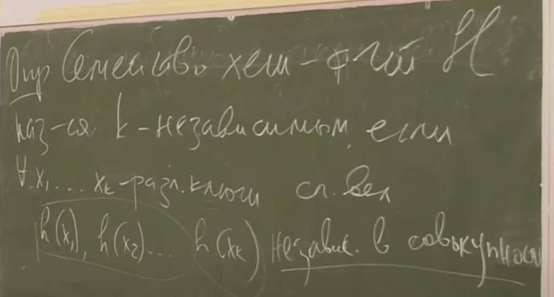

> Теорема(б/д) для линейного пробирования ``(runi = (h(x)+i)%m)``. Если семейство H является 5-независимым, то аморт. мат. ож. времени обработки каждого запроса есть О*(1)

Пример 5-ти независимого семейства:

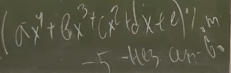

##### Квадратичное пробирование
``runi = (h(x) + i^2) % m``

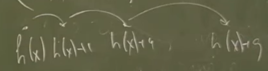

> тут они пересекаются по меньшему кол-ву эл-ов

##### Двойное хеширование

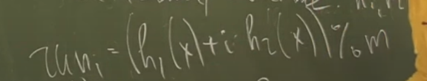

> Теорема(б/д) Для двойного хеширования достаточно 2-независимости

### Фильтр Блума.
> 1. insert x
> 2. find x
> 3. Позволим себе неправильно отвечать на запросы типа find x (делать false positive) с маленькой вероятностью E

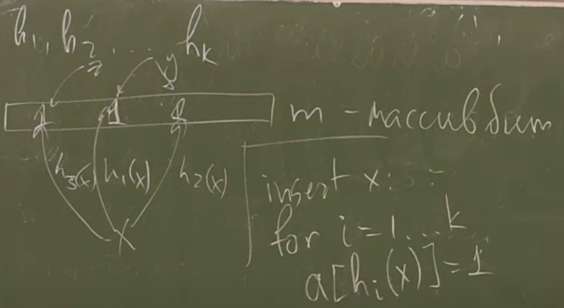
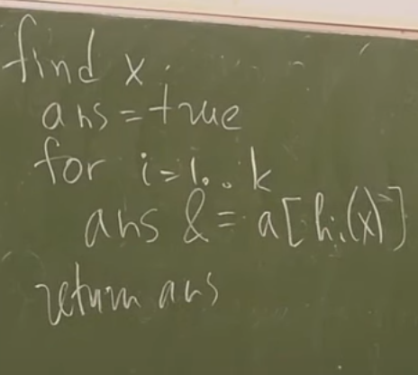

> 4. можно добавить erase (если insert будет не заменять на 1, а увеличивать, а erase - уменьшать на 1)

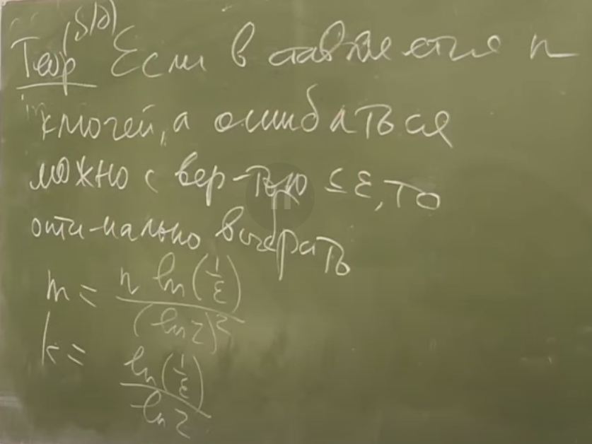