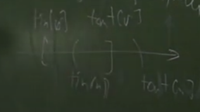
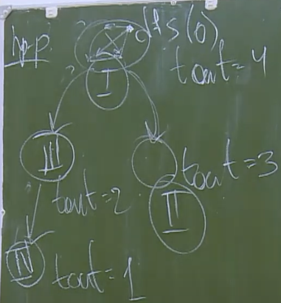
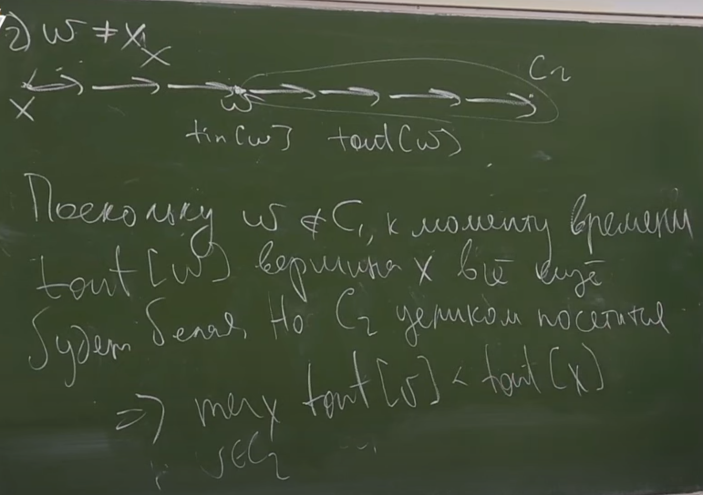

# Графы
***
### Определения
> 1. *Неориетированный граф*:
> ``G = (V, E), V - мн-во, E - подмн-во Cv^2``
> 2. *Ориентированный граф*: 
> ``G = (V, E), V - мн-во, E - подмн-во V^2``
> 3. *Путь*: ``v1, v2, ..., vk`` - посл-ть вершин, т.ч. ``(vi, vi+1) принадлежит E``
> 4. Путь наз-ся *реберно простым*, если ребра не повторяются.
> 5. Путь наз-ся *вершинно простым*, если вершины не повторяются.
> 6. Путь наз-ся *циклом*, если первая и последняя вершины соединены ребром.
> 7. Из вершины ``u`` *достижима* вершина ``v``, если существует путь из u в v.
> 8. Если ``G`` - неор. граф, то вводим *отношение связности*: ``u~v``, если из ``u`` есть путь в ``v``.
> >Отношение связности - отношение эквивалентности (проверяется руками).
> 9. *Компонента связности* - класс эквивалентности относительно отношения связности.
> 10. Если ``G`` - ор. граф, то вводим отношение сильной связности ``u~v``, если есть пути из ``u`` в ``v`` и в обратную сторону. 
> 11. *Компоненты сильной связности* - класс эквивалентности относительно отношения сильной связности.

### Хранение графов
> 1. Матрица смежности. O(n^2) памяти.
> 2. Список ребер. O(m) памяти.
> 3. Списки смежности. O(n + m) памяти. Для каждой вершины храним список её ребер.
> Но за О(1) нельзя проверить наличие ребра в графе. (Но можно решить эту проблему используя совершенное хеширование)

### DFS: depth first search - поиск в глубину

```c++
vector<vector<int>> g;
vector<int> tin, tout;
int timer = 0;
vector<string> color (n, "white");
vector<int> parent;

void dfs(int v, int p = -1) {
    tin[v] = timer++;
    parent[v] = p;
    color[v] = "grey";
    for (int to: g[v]) {
        if (color[to] != "white")
            continue;
        dfs(to, v);
    }
    tout[v] = timer++;
    color[v] = "black";
}

```

### Лемма о белых путях
> Лемма. Если в момент tin[v] есть некий путь из v по белым вершинам, то к моменту tout[v]
> все вершины этого пути станут черными.




### Множество посещаемых вершин dfs

> dfs(s) посетит все вершины, достижимые из s
> 
> Док-во: могут посетиться только достижимые, по лемме о белых путях, все достижимые будут посещены.

### Проверка на ацикличность.
> Если ``if(color[to] == "grey")``, то нашли цикл, если есть цикл, то найдется серая вершина.


> Тогда наличие ребра в серую вершину => наличие ребра в вершину на стеке => цикл найден


> По лемме о белых путях до момента tout[v], посетятся все вершины цикла => в какой-то момент вернемя в S - которое будет серым.


> Асимптотика O(n + m)

#### Чтобы найти цикл, нужно использовать массив ``parent`` 


### Топологическая сортировка
> *DAG* - directed acyclic graph - ор. ациклический граф
> *Топологическая сортировка* - такая перестановка вершин графа, что ребра графа ведут из вершин с меньшим номером в вершины с большим номером


> Найдем топ. сорт. в DAG-е

```c++
for (int v = 0; v < n; ++v) {
    if (color[v] == "white")
        dfs(v);
}
// вывести все вершины в порядке убывания tout
```
Надо доказать, что если (u, v) - edge => tout[u] > tout[v]


> По лемме о белых путях к моменту tout[u], v уже посетится => tout[v] < tout[u]


### Найти число путей в DAG'е

```c++
dp[v]; // число путей, начинающихся в v
```

```c++
dp[v] = 1 + sum(dp[u]); // u: (v, u) - edge
```

```c++
//Идти справа налево по топ. сортировке
```

### Алгоритм Косарайю
(нахождения компонент сильной связности)

```c++
for (int v = 0; v < n; ++v) {
    if (color[v] == "white")
        dfs(v);
}
p; // список вершин в порядке убывания tout
// красим все в белый
// инвертируем ребра
// проходим по p 
// запускаем dfsR (обход в глубину по обратным ребрам)
// каждая новая группа помеченных вершин - новая компонента сильной связности.
```


###### Корректность
> КСС - компонента сильной связности

> Утверждение. Пусть C1 и C2 - различные КСС, причем есть путь из С1 в С2. Тогда max tout[C1] > max tout[C2]




> Докажем, что каждый запуск dfsR будет посещать КСС


> *Конденсация графа* - вершины - КСС, ребра - ребра между КСС (кратные удаляем)  
> Конденсация - всегда DAG