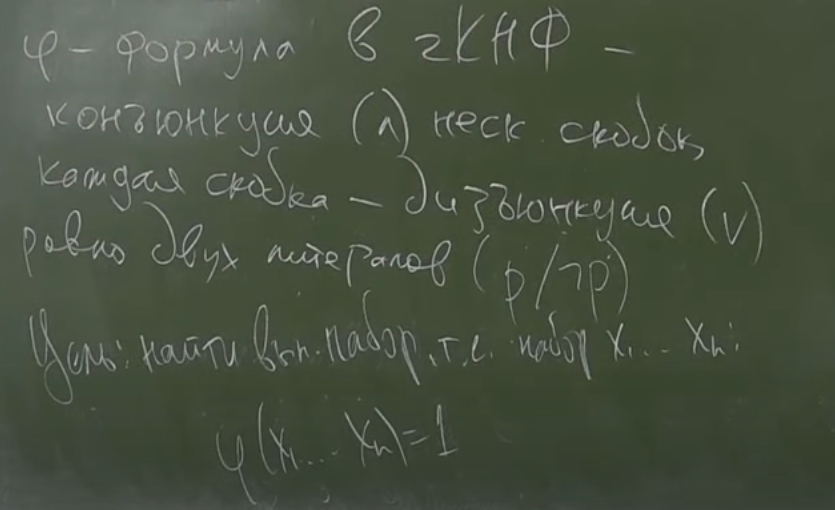
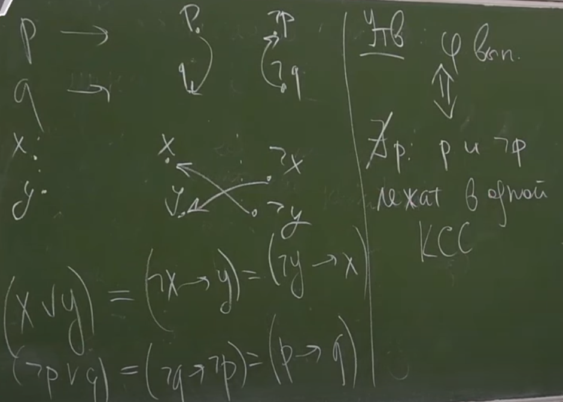
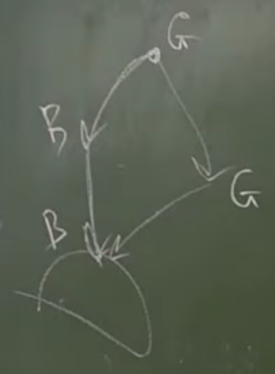
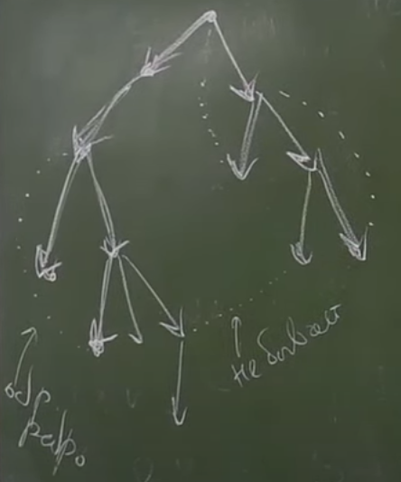
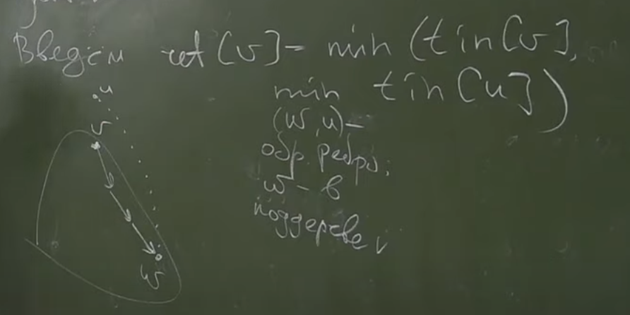
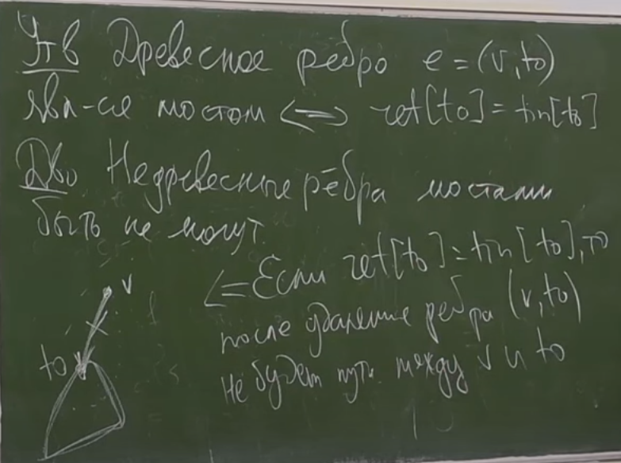
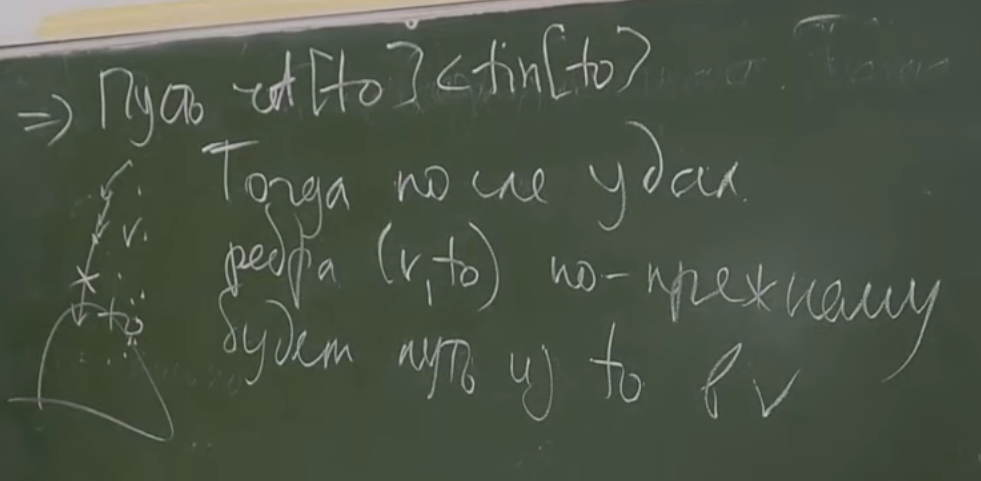

# DAG
***
### Задача 2SAT

> Решение: для каждой переменной создадим две вершины ``p -> p и !p``  
> ``(x v y) = (!x -> y) = (!y -> x)``



> Д-во: (=>)если есть путь ``p -> !p`` и ``!p -> p`` => противоречие
> 
>  (<=) Пусть алгоритм Косарайю сохраняет номер ее КСС - C(v),  
> тогда ``C(p) != C(!p)``,  
> тогда пусть ``p = 1 <=> C(p) > C(!p)`` и ``p = 0``, если наоборот.  
> Тогда, если ``(x V y) = 0 => x = 0, y = 0 => C(x) > C(!x)`` и ``C(y) > C(!y)``, но  ``!x->y`` и ``!y->x`` => ``C(!x) > C(x)``

### DFS в неор. графах
> Отличие от орг. графов:



> В неор. графах не бывает ребер в черные вершины.

```c++
vector<vector<int>> g;
vector<bool> used(n, false); // вместо color
vector<int> tout, tin, parent;

void dfs(int v, int p = -1) {
    parent[v] = p;
    tin[v] = timer++;
    used[v] = ture;
    for(int to: g[v]) {
        if(used[to])
            continue;
        dfs(to, v);
    }
    tout = timer++;
}
```

> Ребра ``(v, to)`` - когда запускается ``dfs(to, v)`` - *древесные* ребра  
> Все остальные ребра - *обратные*



> Связность - смотрим что used.  
> КС - запускаемся из !used.  
> Проверка на ацикличность - отсутствие обратных ребер.  
> Вывод цикла - тоже через parent.

### Мосты, точки сочленения
> Пусть ``G`` - связный, тогда ребро ``е`` - мост, если после его удаления ``G`` становится несвязным

##### Задача - найти все мосты



> ret[v] - как высоко можно выпрыгнуть из поддерева v




### Реализация подсчета ret

```c++
void dfs(int v, int p = -1) {
    parent[v] = p;
    tin[v] = timer++;
    ret[v] = tin[v];
    used[v] = true;
    for (int to: g[v]) {
        if (to == p)
            continue;
        if (used[to])
            ret[v] = min(ret[v], tin[to]);
        else {
            dfs(to, v);
            ret[v] = min(ret[v], ret[to]);
            if (ret[to] == tin[to]) 
                std::cout << "bridge found" << v << to << '\n';
        }
    }
}
```