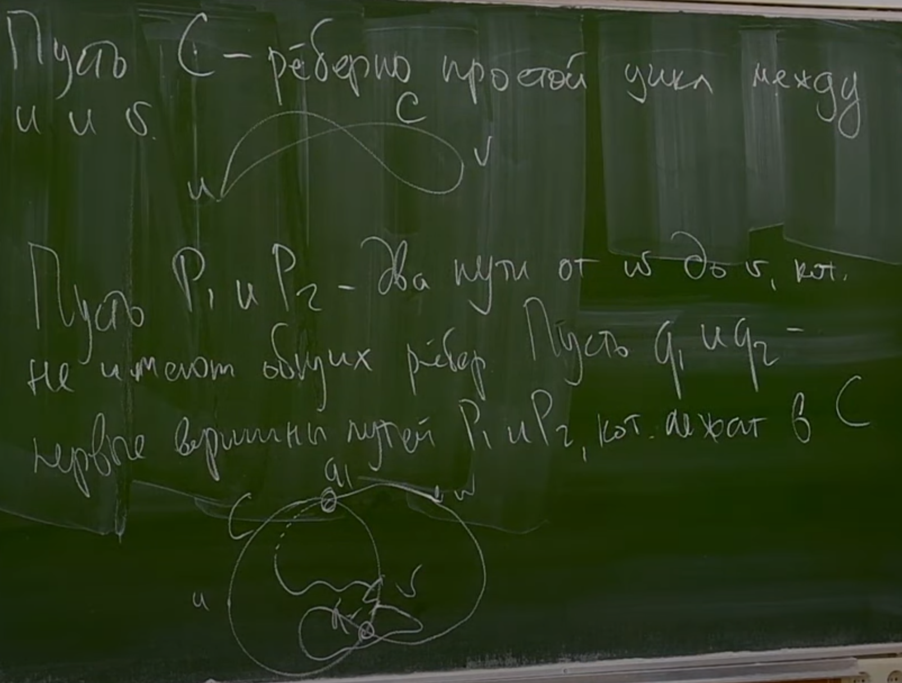
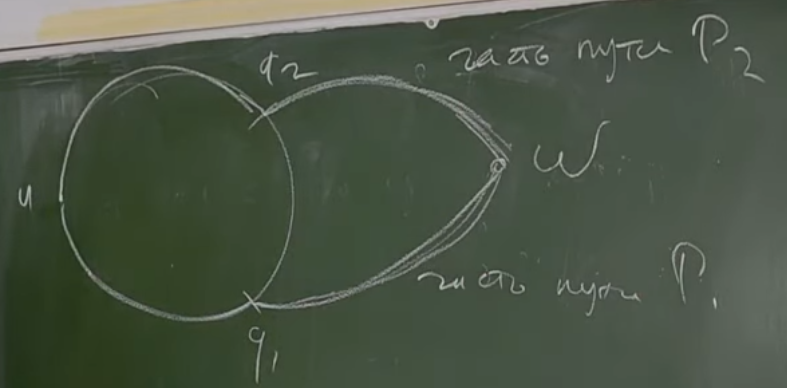
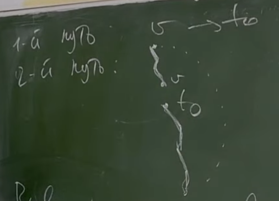
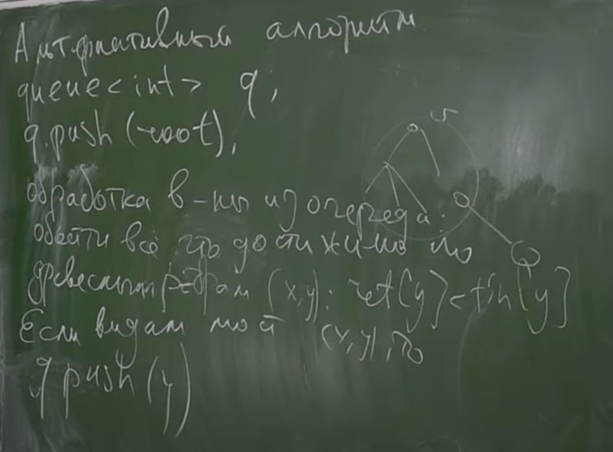
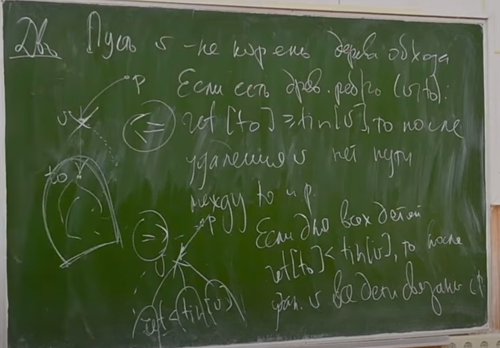
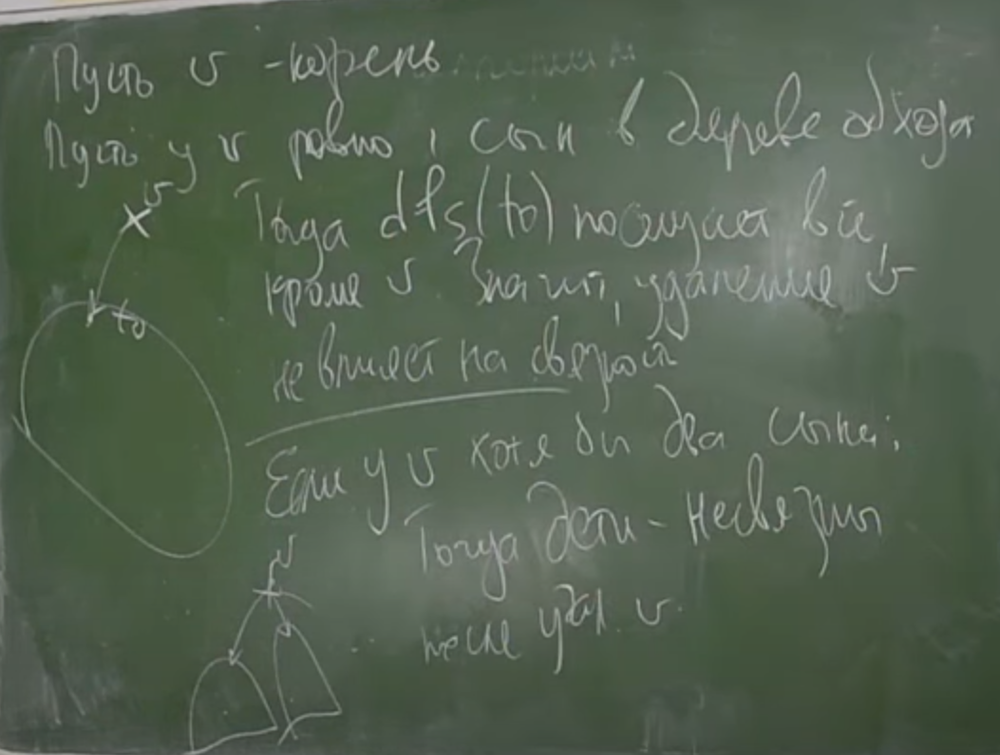
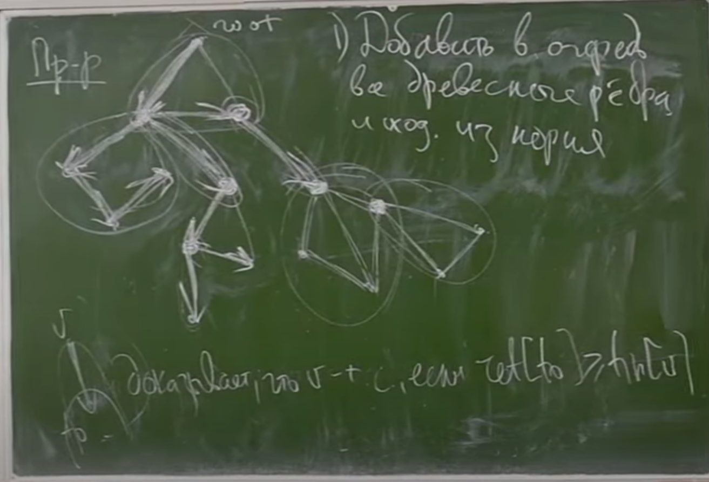
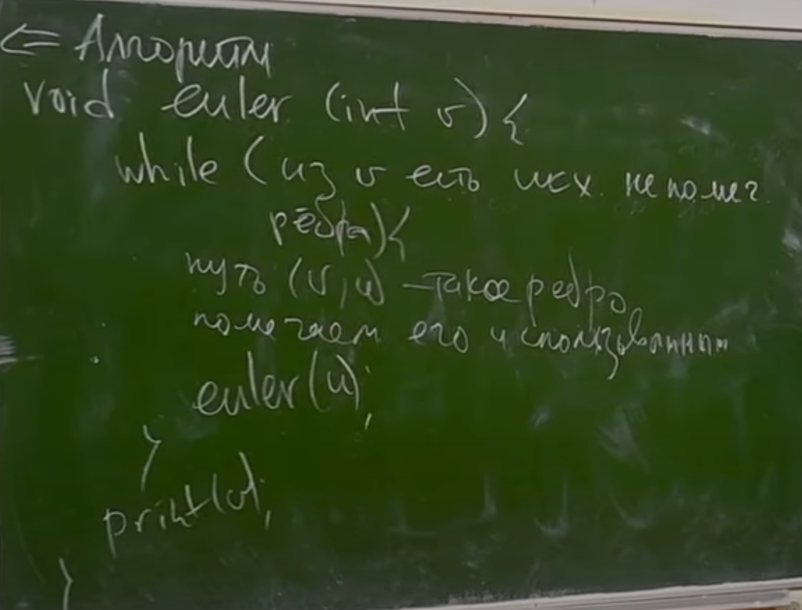
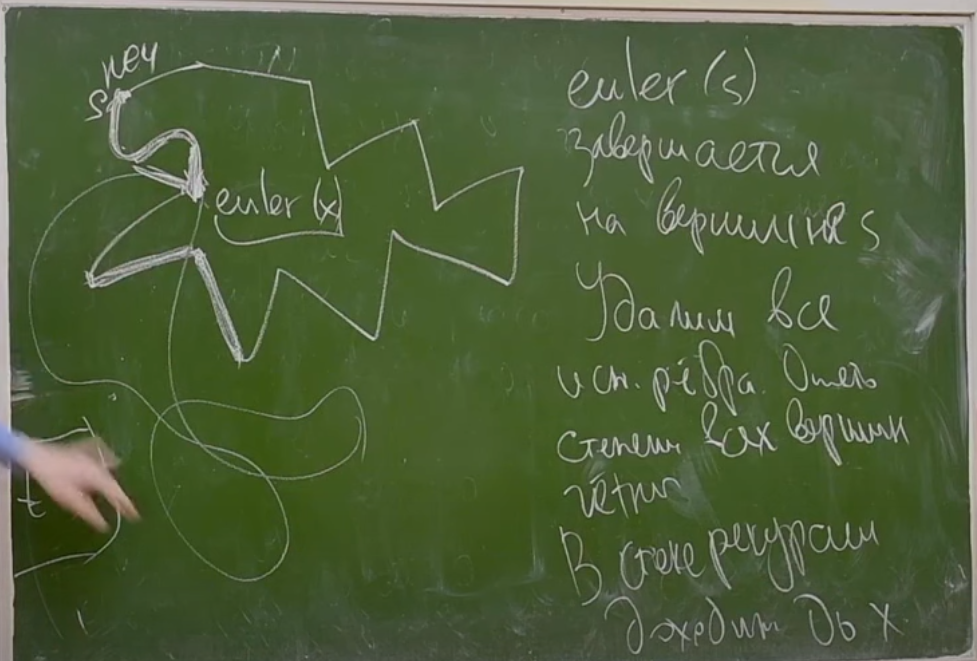

# Двусвязность
***
> Пусть ``G`` - неор. граф, говорим, что вершины ``u`` и ``v`` *реберно двусвязны*, если существует два непересекающихся по ребрам пути между ними. 
> 
> Рёберная двусвязность - отношение эквивалентности.

> * транзитивность (ост. очев.):




> *компонента реберной двусвязности* - класс эквив. по отношению реб. двусвязности

### Как искать КРД
> Утв. компоненты реб. двусявзности - компоненты связности в ``G\мосты``
> 
> Док-во: если ребро - мост, то вершины в компонентах на разных его концах лежат в разных КРД  
> если ребро - не мост, то вершины лежат в одной КРД



> асимптотика O(n + m)



### Точки сочленения

> *Точка сочленения* - вершина, удаление которой, нарушает связность графа

> Утв. Вершина v - явл-ся точкой сочленения <=> v - корень, из v выходит >= 2 древ. ребра или v - не корень, из v есть древесное ребро в to: ret[to] >= tin[v]




> Пусть ``G`` - неор. граф, тогда два его ребра *вершинно двусвязны*, если они лежат на одном реберно простом цикле или равны
> 
> Отн. вершинной двусвязности - отношение эквивалентности.
> 
> *Блок* - класс эквивалентности по вершинной двусвязности

# AAAAAAAAAAAAAAAAAAAAAAAAA CHECK THIS




### Эйлеровость

> Вершина называется *изолированной*, если из нее не выходит ни одного ребра и в неё не входит ни одно ребро
 
> Теор. Пусть G - неор. граф, становящийся связным после удаления всех изол. в-н. Тогда G - Эйлеров цикл, тогда и только тогда, когда все вершины четной степени




```c++
struct edge {
    int from, to; // u->v & v->u с номерами 2k 2k+1 
}; 

vector<int> used(2m);
used[e] = used[e^1] = true;
vector<int> ptr; // первое неисп. ребро
while euler:
    while(ptr[v] < g[v].size()) {
        int e = g[v][ptr[v]];
        if (used[e]) {
            ++ptr[v];
            continue;
        }
        int u;// - конец ребра e
        used[e] = used[e^1] = true;
        ++ptr[v];
        euler(u);
}
```

// асимптотика О(n + m)