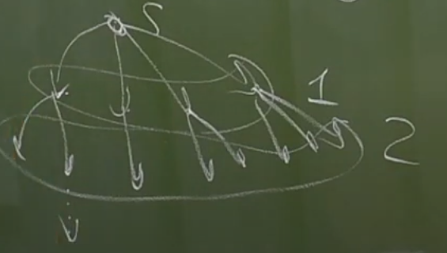
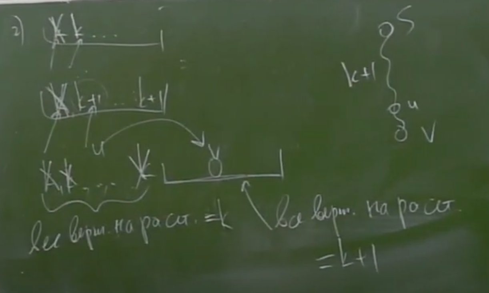
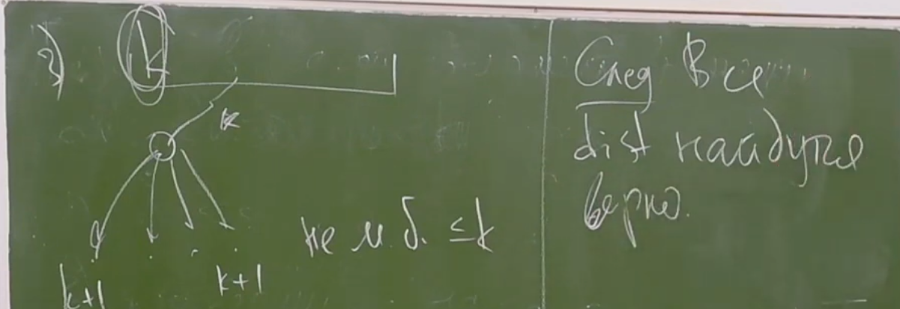

# Кратчайшие пути
***
> Пусть ``G = (V, E)`` - граф. Тогда *кратчайший путь* от ``u`` до ``v`` - это путь из ``u`` в ``v`` минимальной длины, где длина - кол-во ребер в пути.  
> *Взвешенный граф* ``G = (V, E, w)`` - где ``(V, E)`` - граф, а ``w: E -> R`` - весовая ф-ия.  
> *Весом пути* во взв. графе наз-ся сумма весов на ребрах пути  

> Алгоритм поиска кратчайших путей от одной вершины до всех остальных в неор. графе: BFS (breadth first search) - поиск в ширину.



```c++
vector<vector<int>> g;
vector<int> dist(n, +inf);
dist[s] = 0;
queue<int> q;
q.push(s);

while(!q.empty()) {
    int v = q.front(); q.pop();
    for (int to: g[v]) {
        if (dist[to] == +inf) {
            dist[to] = dist[v] + 1;
            q.push(to);
        }
    }
}
``` 

> Асимптотика O(n + m)

### Корректность

> Пусть в какой-то момент времени dist[q.top()] = k. 
> 1. Очередь имеет вид: k, k, k, ..., k, k+1, k+1, ..., k+1.
> 2. Для всех вершин на расстоянии <= k - найдено правильное расст. dist.
> 3. Если алгоритм присваивает dist[to], то он присваивает верное значение.

> Докажем это утв. по индукции:   
> База: q = {s}, k = 0, 1+, 2+, 3+
> 
> Переход:
> 1) k, k, ...k, k+1, k+1, k+1, ..., k+1 - верно 
> 2) k, k, k + 1, ... - все верно
> если же вид k, k + 1, k + 1, ..., то оно перейдет в k + 1, k + 1, ...  
> => нужно показать, что все вершины с посчитанным dist < k + 1 - верно посчитаны




### 0-k-BFS

> ω : Ε → {0, 1, ..., K}
> ⇒
> Все dist ≤ (n - 1) * K < n*K