# Поиск кратчайший путей
***
### Алгоритм A*
> Находит расстояние от s до t   
> g(v) - текущая найденная оценка на dist(s, v),  
> h(v) - оценка на dist(v, t)
> 
> f(v) = g(v) + h(v)
> 
> Грубо говоря, А* - дейкстра на f 

```c++
vector<double> g;
vector<double> f;
priority_queue q; // куча номеров верш. упоряд по f
g[s] = 0;
f[s] = h[s];
q.insert(s);

while (true) {
    int v = q.extractMin();
    if(v == t) 
        break;
    for (edge e: graph[v]) {
        x = g[v] + e.cost;
        if (g[e.to] > x) {
            g[e.to] = x;
            f[e.to] = g[e.to] + h(e.to);
            ecли e.to находится в q, то decreaseKey;
            иначе insert;
        }
    }
}
```

> Ф-ия h(*эвристика*) наз-ся *допустимой*, если ∀v: 0 ≤ h(v) ≤ dist(v, t)  
> Эвристика наз-ся монотонной, если ∀(u, v): h(u) ≤ h(v) + e.cost & h(t) = 0

> Теорема(б/д)  
> 1) Если h - монотонная эвристика, то А* всегда вернет прав. ответ, при этом каждая вершина раскроется ≤1 раза
> 2) Если h - допустимая, то A* всегда вернет прав. ответ, то в худшем случае за exp-время
> 3) Если h - недопустимая, то A* может вернуть хорошее приближение к ответу (но в худшем случае неверный ответ + exp-время)

> Утв. Если h - монотонная, то в А* посл-ть f(v1) ≤ f(v2) ≤ ... из извлекаемых вершин не убывает

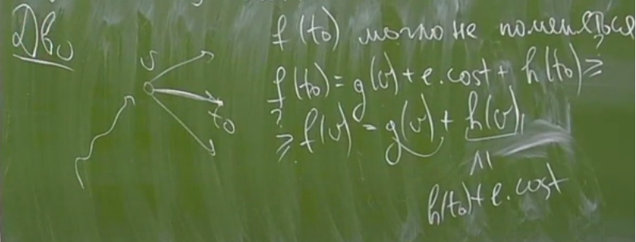

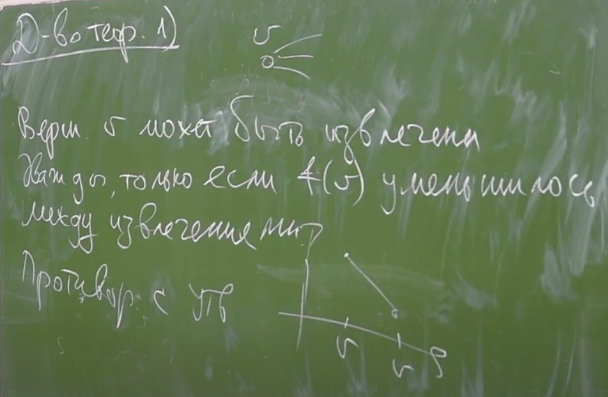
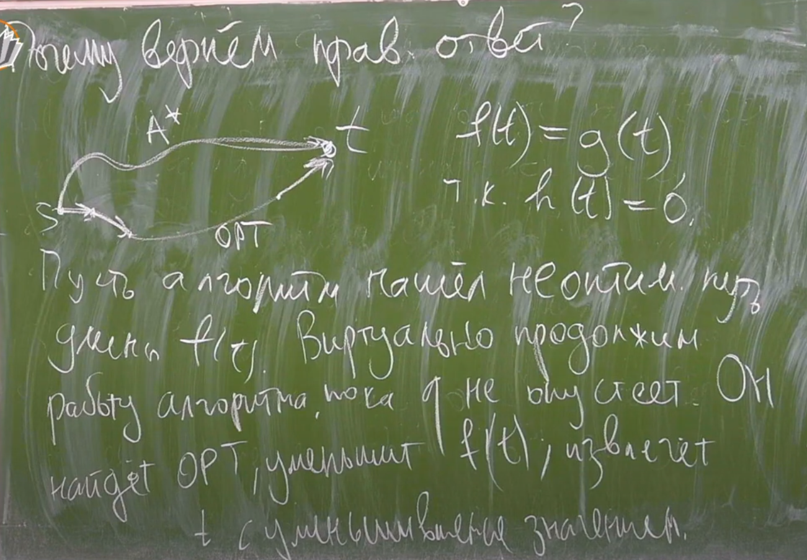

> Асимптотика O(m * log n)

### Примеры эвристик
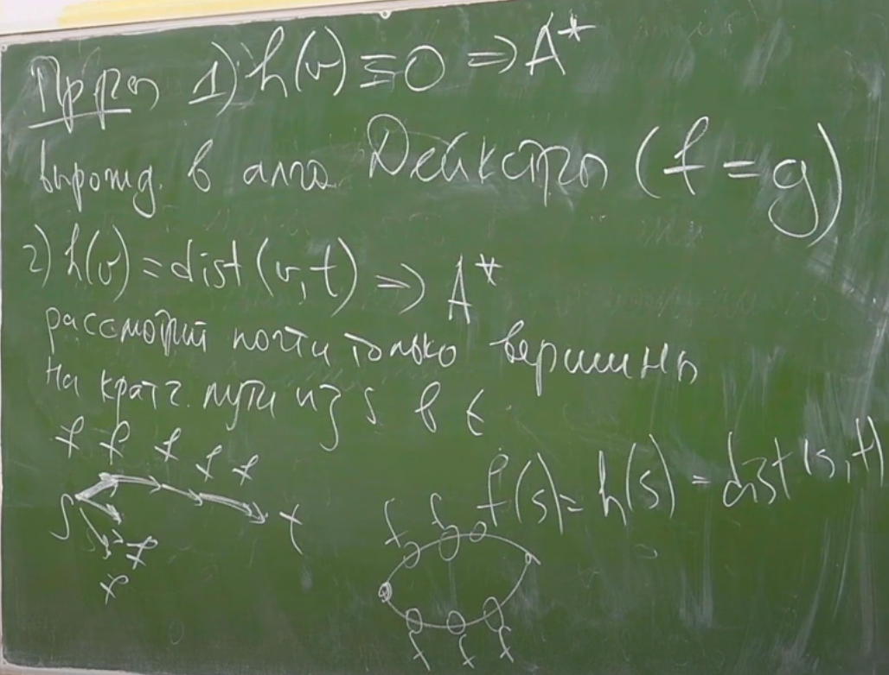
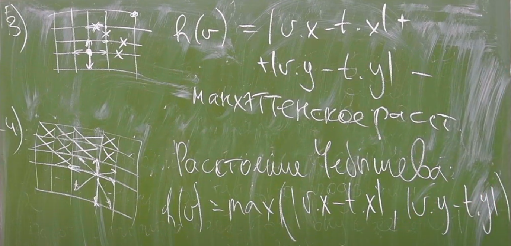
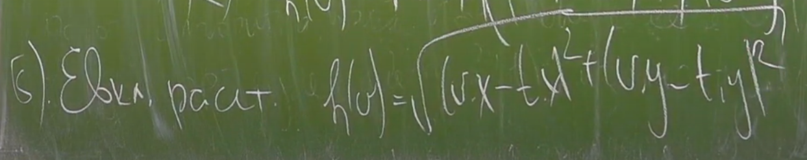
> Евклидова метрика - если большая степень дискретизации (много разных направлений)

### Алгоритм Флойда
> Пусть в графе м.б. отриц. ребра, но нет отриц. цикловю Тогда алгоритм Флойда находит все попарные кратчайшие расстояния  
> ∀(u, v) → dist(u, v)

```c++
dp[i][j][k]; // min расстояния из i в j, т.ч. все промежуточные вершины ≤ k
```
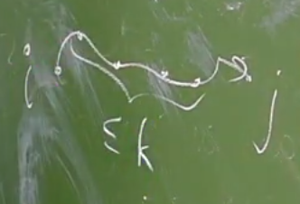
```c++
dp[i][j][0] = min(cost(i, j), +∞);
```
```c++
// k → k+1
dp[i][j][k+1] = min(dp[i][j][k], dp[i][k+1][k] + dp[k+1][j][k]); // тут важно, что нет отриц циклов
```
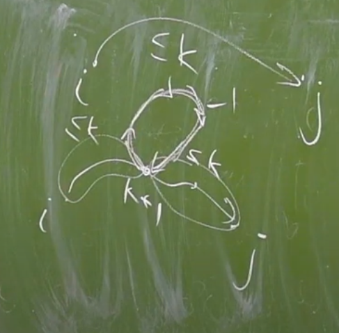
```c++
for (k)
    for (i)
        for (j)
```
> Асимптотика O(n^3)

> Можно обрезать последнее измерение (изначально g[i][j] - стоимость ребра (i, j) ) 
```c++
for (k = 1...n)
    for (i = 1...n)
        for (j = 1...n) {
            g[i][j] = min(g[i][j], g[i][k] + g[k][j]); 
        }
```

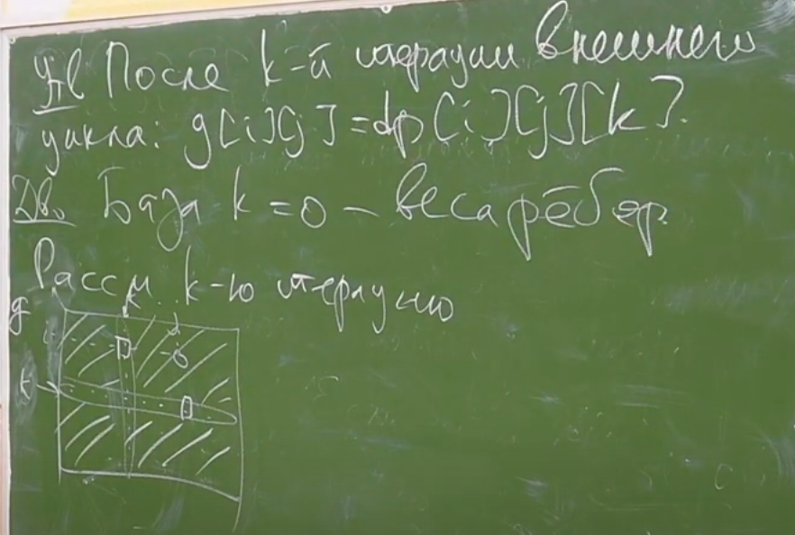

> Восстановление ответа, т.е. восст. самих путей. Когда g[i][j] обновляется через g[i][k] + g[k][j], запомним p[i][j] = k,   
> тогда путь из i в j выглядит так: путь из i в p[i][j] + путь из p[i][j] в j

### Алгоритм Форда-Беллмана
> В графе могут быть и отриц. ребра и отриц. циклы   
> dist(s, t) = -∞ ⇔ ∃ цикл C отриц веса, т.ч. s → C → t  

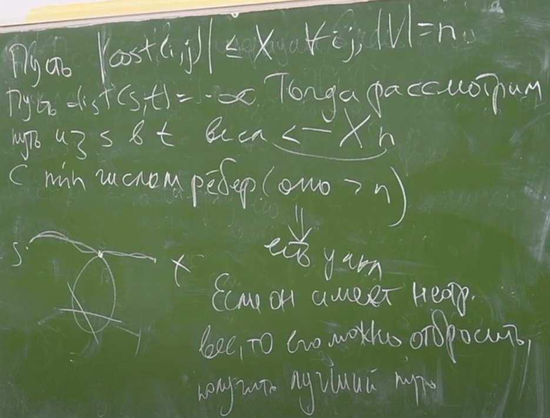

> Алгоритм находит кратчайшее расстояние от s до всех
```c++
dp[v][k]; // min - вес пути из s в v, использующий ≤k ребер
```
```c++
dp[v][0] = {0, v = s or -∞, s ≠ v};
```
```c++
dp[v][k] = min(dp[v][k - 1], (u,v)|min(dp[u][k-1] + cost(u, v)));
```
```c++
// Если в G нет отриц циклов, то 
// ∀v: dp[v][n - 1] = dist(s, v);
```

> Асимптотика O(n * m); n слоев, m - время обработки слоя  
> Достаточно O(n) слоев динамики


> Пусть в G могут быть отрицательные циклы,  
> сделаем на одну итерацию больше в нашей динамике

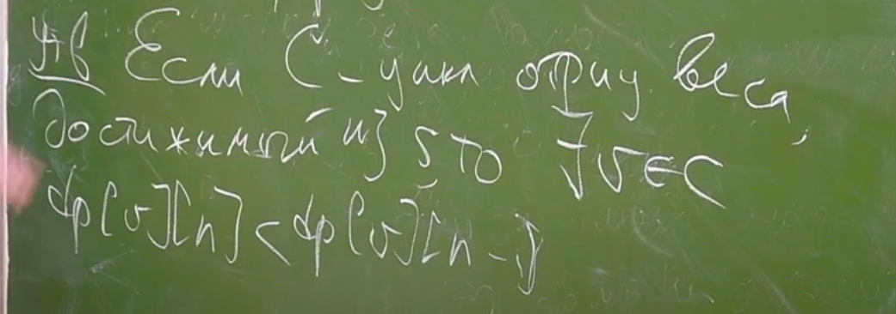
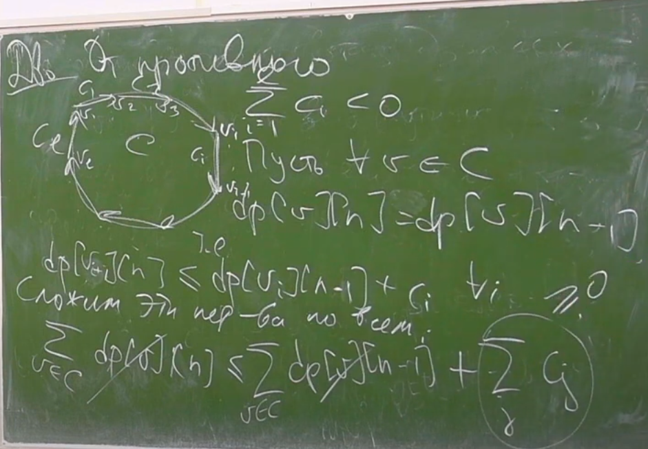

> Зам. Если dp[v][n] < dp[v][n - 1] < dp[v][n - 1]
> ∀u
> dist(s, u) - ?
> 
> 1. dist(s, u) = -∞. если ∃v: dp[v][n] < dp[v][ n - 1] и u достижима из ∨
> 2. dist(s, u) = dp[u][n - 1], иначе (т.к. в этом пути нет отриц циклов)

> Алгоритм: Форд-Беллман на n итераций, dfs из всех вершин с dp[v][n] < dp[v][n - 1] Посещенные - dist[v] = -∞
