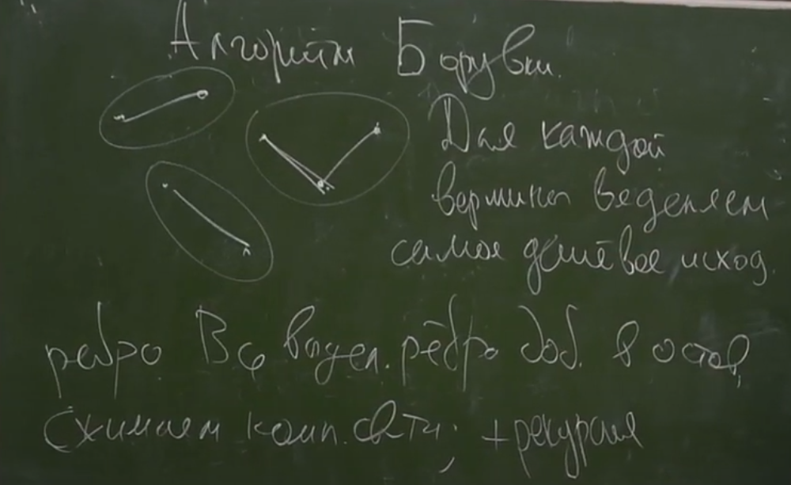
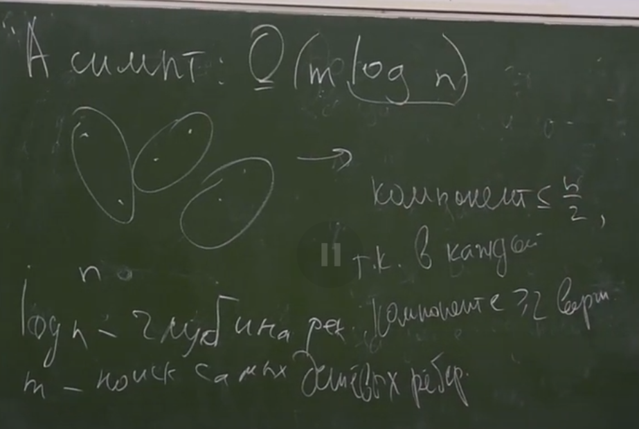

# Минимальные остовы
***
> Γ = (V, Ε) - неор. граф. Тогда H ⊂ Γ - *остовный подграф*, если V(H) = V(G)  
> Γ = (V, E), тогда остовный подграф H ⊂ Γ наз-ся *остовным деревом*, если он - дерево

### Задача: в данном взвешенном графе найти остов минимального веса

### Лемма (о безопасном ребре)


### Алгоритм Прима
> Т - одна вершина  
> n раз применяем Лемму
> 
##### за O(n^2)


##### за О(m*log n)
> бин-кучей  
> n extractMin  
> m decreaseKey
##### за O(m+n*log n)
> Фибоначчиевой кукучей
### Алгоритм Крускала

##### СНМ/DSU
> Система непересекающихся множеств  
> 1. Проверить лежат ли два эл-та в одном мн-ве
> 2. Объединить два данных мн-ва


 
```c++
int get (int v) {
    if (p[v] == -1)
        return v;
    return get(p[v]);
}
void unite (int n, int v) {
    u = get(u); v = get(v);
    if (size[u] < size[v])
        swap(u, v);
    p[v] = u;
    size[u] += size[v];
}
```

> работает за O(log n)


```c++
int get(int v) {
    if (p[v] == -1) 
        return v;
    return p[v] = get(p[v]);
}
```


##### Асимптотика Крускала


### Алгоритм Борувки



=> так как выбираем наименьшую вершину, то противоречие т.е. циклы длины 2 максимум


