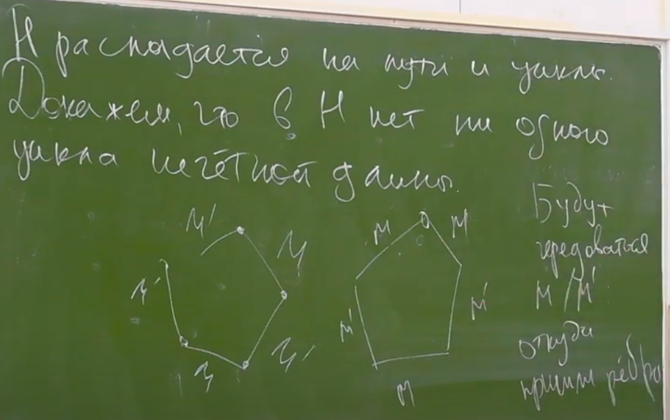

# Паросочетания
***
> Пусть G = (V, Ε) - неор. граф. Тогда M ⊂ E наз-ся *паросочетанием*, если никакие два ребра М не имеют общих вершин (иными словами, степень каждой вершины ≤1)  
> 
>Граф G = (V, E) наз-ся *двудольным*, если ∃L, R: V = L ⊔ R, при это ∀{u, v} ∈ E: u ∈ L, v ∈ R или u ∈ R, v ∈ L  
>
> Пусть М - паросочетание в графе G. Тогда простой путь в G наз-ся *увеличивающим путем*, если первая и последняя вершины ненасыщенны М, а типа ребер на пути чередуются  


### Теор. Бержа

> Док-во леммы очев.





### Алгоритм поиска макс парсоч (идея)

### Алгоритм Куна (G - двудольный, n и k)
```c++
vector<vector<int>> g;
vector<bool> used(n, false);
vector<int> match(k, -1);

bool augment(int v) {
    if(used[v])
        return false;
    
    used[v] = true;
    for (int to: g[v]) {
        if (match[to] == -1 || augment(match[to])){
            match[to] = v;
            retuen true;
        }
        return false;
    }
}

for (int v = 0; v < n; ++v)
    if(augment(v)) 
        used.assign(n, false); // так как нет смысла сбрасывать used если не меняли граф
```


### Независимые мн-ва
> Пусть G = (V,Ε) - граф, мн-во I ⊂ V наз-ся *независимым*, если ∀a,b ∈ I : {a, b} ∉ Ε
> 
> Пусть G = (V,Ε) - граф, мн-во C ⊂ V наз-ся *вершинным покрытием*, если ∀{u,v} ∈ E: u ∈ Ε or v ∈ E


### Поиск max независимого мн-ва и min верш покр. в двудольном графе


