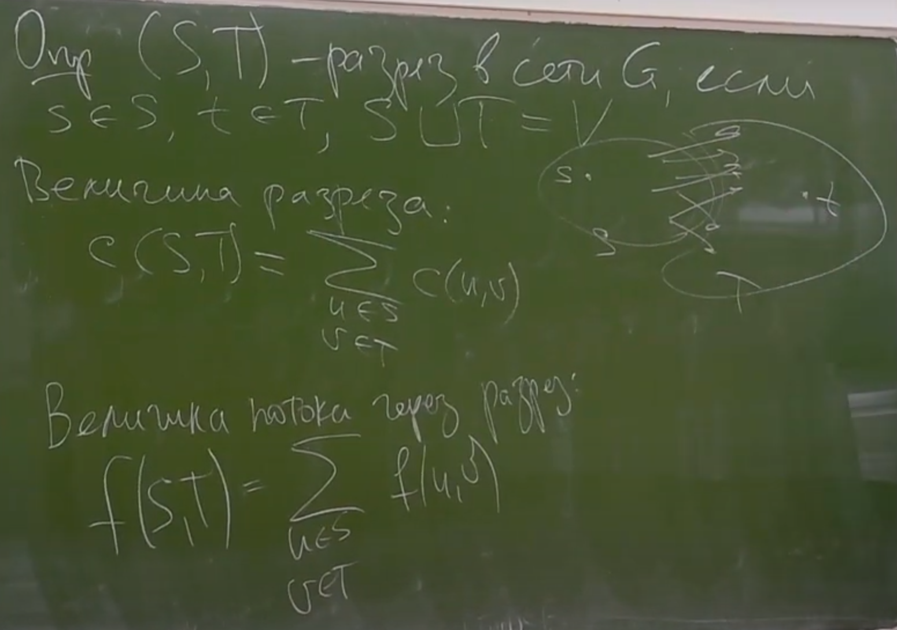
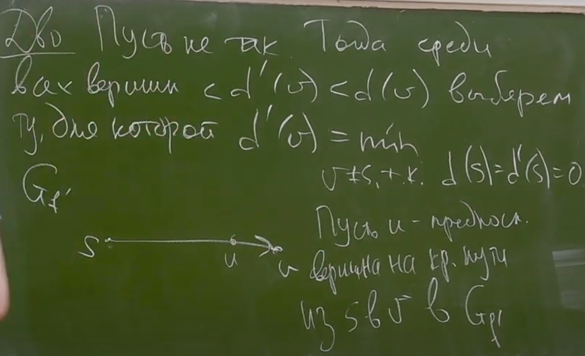
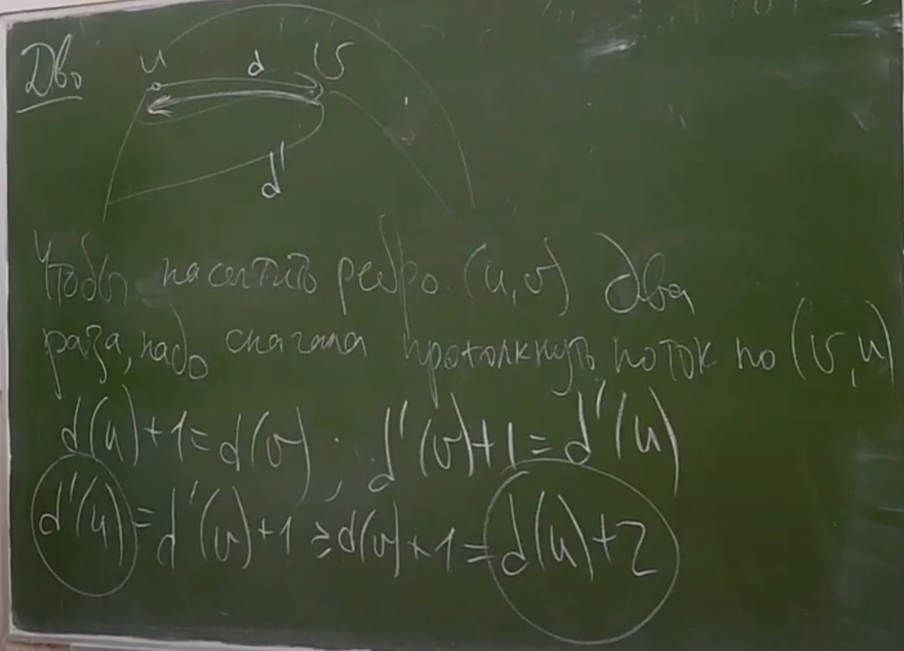

# Потоки
***
### Определения

> *Сеть* = (G, s, t, c) где, G = (V, E) - ор. граф, s ∈ V, t ∈ V, s ≠ t - исток и сток соотв.
> с: E → Ζ ≥0 (пропускные способности ребер, capacity)
> 
> Пусть (G, s, t, c) - сеть. Тогда f: VxV → Ζ, наз-ся *потоком* в этой сети, если:
> 1. ∀u,v ∈ V f(u, v) ≤ c(u,v)  
> если считать, что при отсутствии ребра c(u, v) = 0
> 2. (антисимметричность): ∀u,v ∈ V f(u,v) = -f(v,u)
> 3. (сохранение потока): ∀v ∈ V\{s,t}:
 
> 
> Пусть (G, s, t, c) - сеть. А f - поток в ней. Остаточная сеть Gf: мн-во вершин, s, t сохранятся, а Cf(u,v) = c(u,v) - f(u,v); - остаточная пропускная способность.
> при этом ребра с нулевой Cf не проводятся.
> 

### Теор. Форда-Фалкерсона

>

   

### Алгоритм Форда-Фалкерсона

### Алгоритм Эдмондса-Карпа

### Задача о распределении людей на две группы

