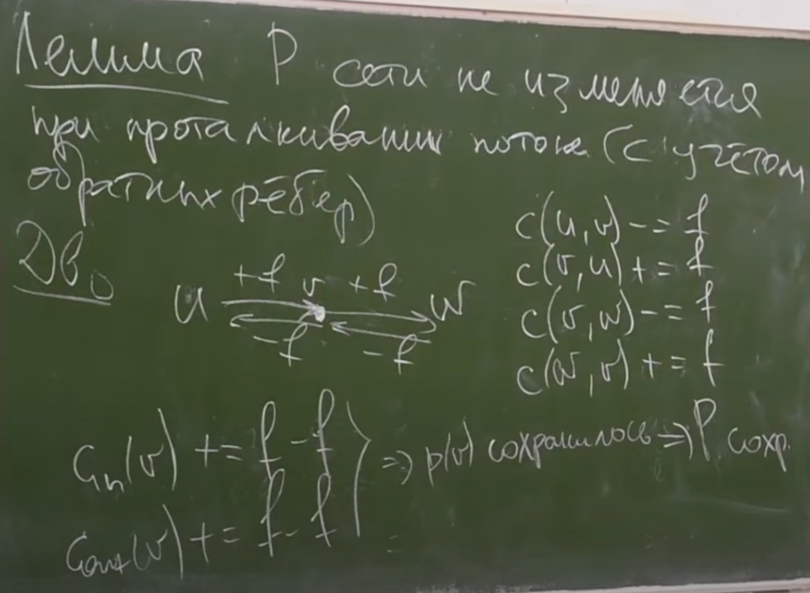

# Ускорение потоков
***
### Техника масштабирования


### Алгоритм Ефима Диница 


```c++
int dfs(int v, int f) {
    if (v == t) return f;
    while(ptr[v] < g[v].size()) {
        e - ребро с номером ptr[v] в списке g[v];
        
        if(level[v] + 1 != level[to] || e.capaity == e.flow)
            ++ptr;
        
        x = dfs(to, min(f, e.cap - e.flow));
        if (x == 0) {
            ++ptr; 
            continue;
        }
        e.flow += x;
        reverse_e.flow -= x; 
        return x;
    }
    return 0;
}


while(true) {
    x = dfs(s, ∞);
    if (x == 0) break;
}
```


> ⇒ число итераций O(V)


### Теорема Карзанова 1





### Алгоритм Диница в единичных сетях


### Алгоритм Хопкрофта-Карпа


